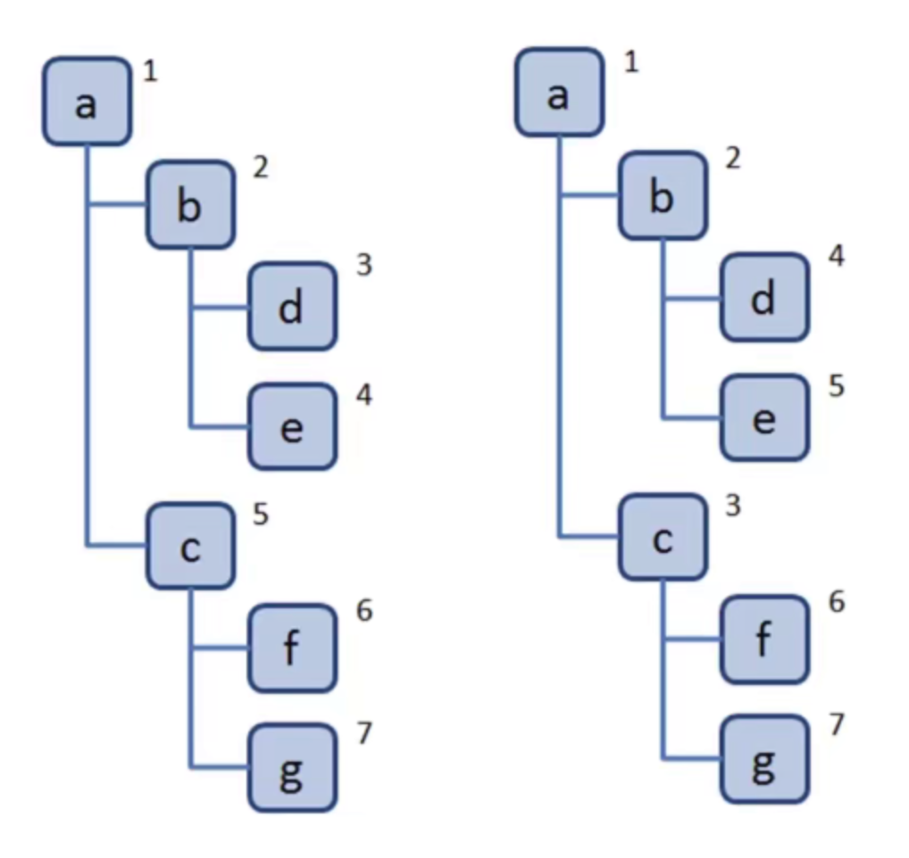
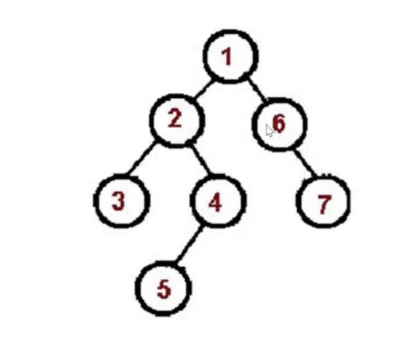
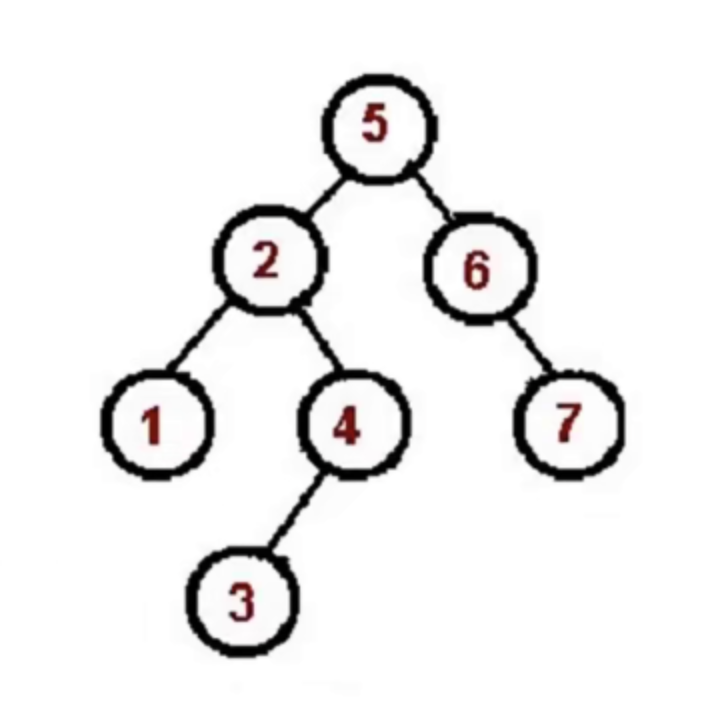
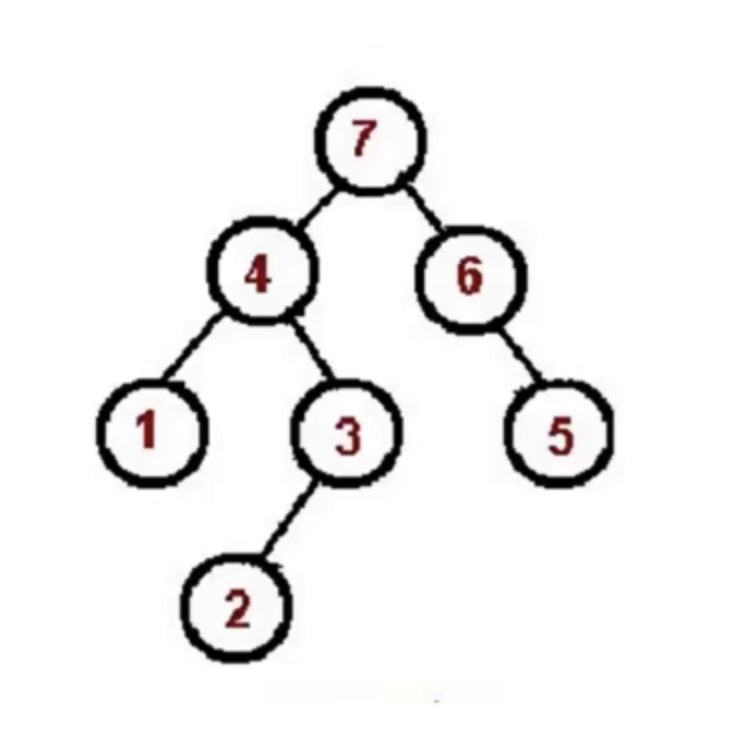

# 树

+ 一种分层数据的抽象模型

+ 前端工作中常见的树包括：DOM

  树、级联选择、树形控件……


## 树是什么？

+ JS 中没有树，但是可以用 Object 和 Array 构建树

```js
{
  value: '01'，
  label: 'level01'，
  children: [
    {
      value: '02'，
      label: 'level02',
      children: [
      	{
      		value: '03'，
      		label： 'level03'
    		}
      ]
    }
  ]
}
```

+ 树的常用操作：深度 / 广度优先遍历、先中序遍历（二叉树）


## 树的深度与广度优先遍历

### 什么是深度 / 广度优先遍历？

+ **深度优先遍历**：尽可能深的搜索树的分支

+ **广度优先遍历**：先访问离根节点最近的节点




### 深度优先遍历(DFS)算法口诀

+ 访问根节点
+ 对根节点的 children 挨个进行深度优先遍历(**递归**)

```js
const tree = {
    val: 'a',
    children: [
        {
            val: 'b',
            children: [
                {
                    val: 'd',
                    children: []
                },
                {
                    val: 'e',
                    children: []
                }
            ]
        },
        {
            val: 'c',
            children: [
                {
                    val: 'f',
                    children: []
                },
                {
                    val: 'g',
                    children: []
                }
            ]
        }
    ]
}


const dfs = (root) => {
    console.log(root.val)
    root.children.forEach((child) => {
        dfs(child)
    })
    // 可简写
    // root.children.forEach(dfs) 
}

console.log(dfs(tree));
```


### 广度优先遍历(BFS)算法口诀

+ 新建一个队列，把根节点入队
+ 把对头出队并访问
+ 把对头的children 挨个入队
+ 重复第二、三步，直到队列为空

```js
const bfs = (root) => {
    // 1. 新建一个队列，把根节点入队
    const q = [root]
    // 4. 重复出队、入队
    while(q.length > 0) {
        // 2. 把对头出队并访问
        const n = q.shift()
        console.log(n.val)
        // 3. 把对头的children 挨个入队
        n.children.forEach(child => {
            q.push(child)
        })
    }
}

console.log(bfs(tree));
```


## 二叉树的先中后序遍历

+ 数中每个节点最多只能有两个子节点
+ 在JS 中用 Object 来模拟二叉树

```js
const binaryTree = {
  val: 1,
  left: {
    val: 2,
    left: null,
    right: null
  },
  right: {
    val: 3,
    left: null,
    right: null
  }
}
```


### 先序遍历算法口诀

+ 访问根节点
+ 对根节点的左子树进行先序遍历
+ 对根节点的右子树进行先序遍历




```js
// bt.js
const bt = {
    val: 1,
    left: {
        val: 2,
        left: {
            val: 4,
            left: null,
            right: null
        },
        right: {
            val: 5,
            left: null,
            right: null
        }
    },
    right: {
        val: 3,
        left: {
            val: 6,
            left: null,
            right: null
        },
        right: {
            val: 7,
            left: null,
            right: null
        }
    }
}

module.exports = bt

// preorder.js
const bt = require('./bt')

const preOrder = (root) => {
    if (!root) {
        return
    }
    console.log(root.val)
    preOrder(root.left)
    preOrder(root.right)
}

preOrder(bt)
```


### 中序遍历的算法口诀

+ 对根节点的左子树进行中序遍历
+ 访问根节点
+ 对根节点的右子树进行中序遍历



```js
// inorder.js
const bt = require('./bt')

const inOrder = (root) => {
    if (!root) {
        return
    }
    inOrder(root.left)
    console.log(root.val)
    inOrder(root.right)
}
inOrder(bt)
```


### 后序遍历算法口诀

+ 对根节点的左子树进行后序遍历
+ 对根节点的右子树进行后序遍历
+ 访问根节点



```js
// postorder.js
const bt = require('./bt')

const postOrder = (root) => {
    if (!root) {
        return
    }
    postOrder(root.left)
    postOrder(root.right)
    console.log(root.val)
}
postOrder(bt)
```


## 二叉树的先中后序遍历(非递归版)

#### 先序遍历

```js
const stackPreOrder = (root) => {
    if (!root) return 
    const stack = [root]
    
    while(stack.length) {
        const n = stack.pop()
        console.log(n.val)
    
        if (n.night) stack.push(n.right)
        if (n.left) stack.push(n.left)
    }
}
stackPreOrder(bt)
```


#### 中序遍历

```js
const stackInOrder = (root) => {
    if (!root) return 
    const stack = [root]
    let p = root // 定义一个指针
    while(stack.length || p) {
        stack.push(p)
        p = p.left

        const n = stack.pop()
        console.log(n.val)
        p = n.right
    }
}

stackInOrder(root)
```


#### 后序遍历

```js
const stackPostOrder = (root) => {
    if (!root) return 
    const outputStack = []
    const stack = [root]
    while (stack.length) {
        const n = stack.pop()
        // console.log(n.val)
        outputStack.push(n)
        if (n.left) stack.push(n.left)
        if (n.night) stack.push(n.right)
    }
    while(outputStack.length) {
        const n = outputStack.pop()
        console.log(n.val)
    }
}

stackPostOrder(bt)
```


## leetCode: 104. 二叉树的最大深度

#### 题目描述

给定一个二叉树，找出其最大深度。

二叉树的深度为根节点到最远叶子节点的最长路径上的节点数。

**说明:** 叶子节点是指没有子节点的节点。

**示例：**
给定二叉树 `[3,9,20,null,null,15,7]`，

```
    3
   / \
  9  20
    /  \
   15   7
```

返回它的最大深度 3 。

#### 解题思路

+ 求最大深度，考虑使用深度优先遍历

+ 在深度优先遍历过程中，记录每个节点所在的层级，找出最大的层级即可

  


#### 解题步骤

+ 新建一个变量，记录最大深度
+ 深度优先遍历整颗树，并记录每个节点的层级，同时刷新最大深度这个变量
+ 遍历结束返回最大深度这个变量


```js
/**
 * Definition for a binary tree node.
 * function TreeNode(val, left, right) {
 *     this.val = (val===undefined ? 0 : val)
 *     this.left = (left===undefined ? null : left)
 *     this.right = (right===undefined ? null : right)
 * }
 */
/**
 * @param {TreeNode} root
 * @return {number}
 */
const maxDepth = function(root) {
    let res = 0
    const dfs = (n, l) => {
        if (!n) return 
        // console.log(n.val, l)
        //*  当左右子树为空时，就是最大深度
        if (!n.left && !n.right) {
            res = Math.max(res, l)
        }
        dfs(n.left, l + 1)
        dfs(n.right, l + 1)
    }
    dfs(root, 1)
    return res
}
```

