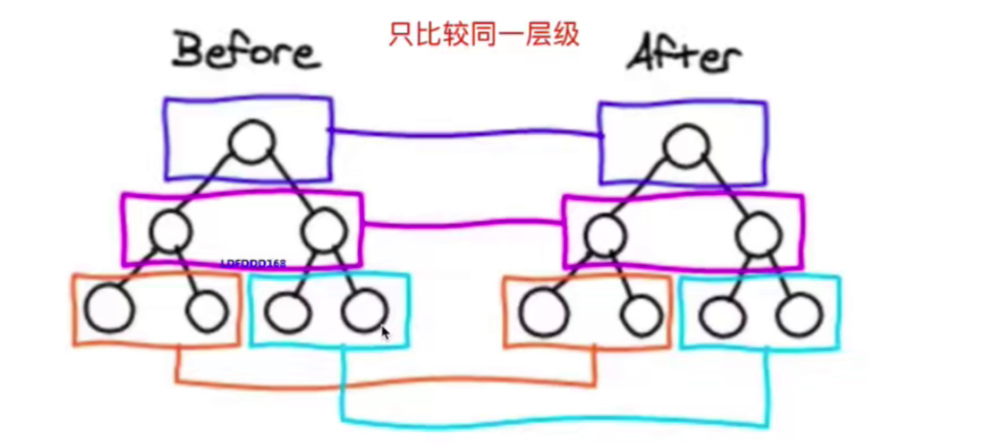
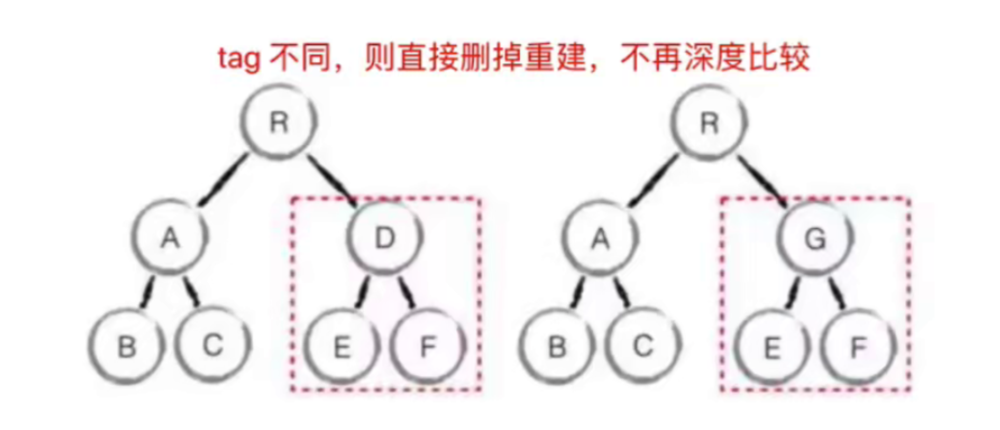

# 虚拟DOM (Virtual DOM) 和 diff

- vdom 是实现 vue 和 react 的重要基石
- diff 算法是 vdom 中最核心、最关键的部分
- vdom 是一个热门话题，也是面试中的热门问题

## 虚拟DOM（vdom）

- DOM 操作非常耗费性能
- 以前用jQuery ，可以自行控制 DOM操作的时机，手动调整
- Vue 和 React 是数据驱动视图，如何有效控制 DOM操作？

**解决方案 - vdom**

- 有了一定复杂度，想减少计算次数比较难
- 能不能把计算，更多的转移为JS计算？因为JS执行速度很快
- vdom - 用JS模拟DOM结构，计算出最小的变更，操作DOM

### 用JS模拟DOM 结构

### 通过 snabbdom 学习 vdom

> https://github.com/snabbdom/snabbdom

- 简洁强大的 vdom 库，易学易用
- Vue 参考它实现的 vdom 和 diff
- Vue3.0 重写了vdom 的代码，优化了性能
- 但 vdom 的基本理念不变，面试考点也不变
- React vdom 具体实现和Vue 也不同，但不妨碍统一学习

## diff 算法

- diff 算法是 vdom 中最核心、最关键的部分
- diff 算法能在日常使用 vue React中体现出来（如 key）
- diff 算法是前端热门话题，面试“宠儿”

### diff算法概述

- diff 即 对比，是一个广泛的概念，如 linux diff 命令、git diff 等
- 两个 js 对象也可以做 diff https://github.com/cujois/jiff
- 两棵树做 diff，如这里得 vdom diff

#### 树 diff 的时间复杂度 O(n^3)

- 第一，遍历 tree1；第二，遍历 tree2
- 第三，排序
- 1000个节点，要计算 1亿次，算法不可用

#### 优化时间复杂到O(n)

- 只比较同一层级，不跨级比较
- tag不相同，则直接删掉重建，不再深度比较
- tag 和 key ，两者都相同，则认为是相同节点，不再深度比较

